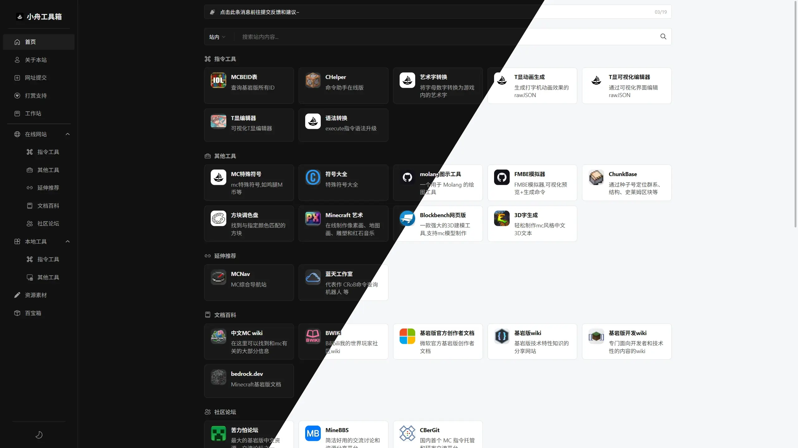
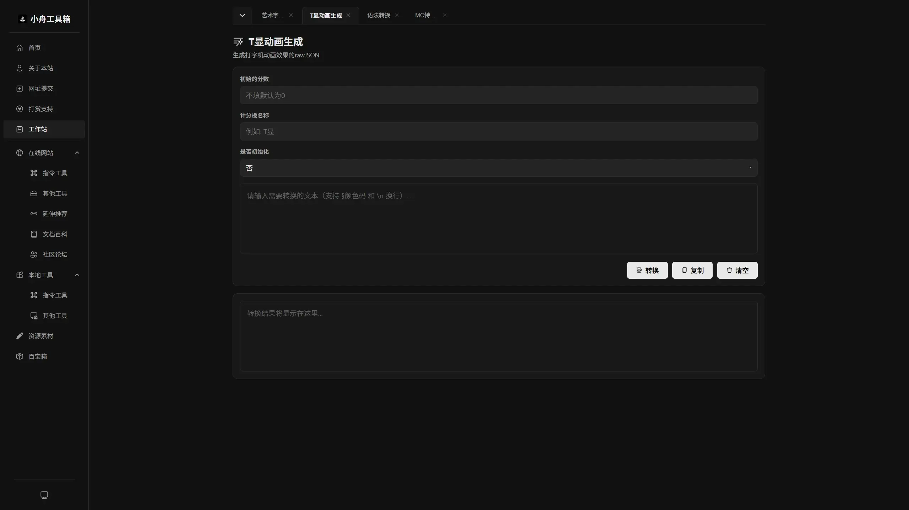

<div style="display:flex;">
  
</div>

# 小舟工具箱

[](https://vuejs.org/)
[](https://vitejs.dev/)
[](https://pnpm.io/)
[](https://nodejs.org/)
[](LICENSE)
[](https://x.com/karpathy/status/1886192184808149383)

一个简洁高效的 Minecraft 基岩版命令工具导航网站，聚合各类命令相关工具、文档与社区资源，其中100%的代码由 LLM 生成。




## 特点

- 🗂️ **分类清晰**： 将工具分为"在线网站"和"本地工具"两大类，方便快速定位
- 🔎 **智能搜索**： 支持多种搜索引擎一键切换，满足不同搜索需求
- 🌙 **主题切换**： 支持明暗模式自由切换，自动记忆用户偏好
- 📑 **标签页布局**： 快速切换不同工具页，大幅提升效率
- 📱 **响应式布局**： 完美适配桌面端与移动端，提供一致的优质体验
- 🍪 **隐私保护**： Cookie 同意管理、隐私政策透明披露、可选的流量分析
- ⚡ **PWA 支持**： 可安装到桌面，支持离线访问

## 技术栈

| 类别     | 技术                           |
| -------- | ------------------------------ |
| 框架     | Vue 3、Vite                    |
| UI 库    | Naive UI                       |
| 路由     | Vue Router                     |
| SEO      | @vueuse/head、Puppeteer 预渲染 |
| PWA      | vite-plugin-pwa (Workbox)      |
| 图标     | @vicons/fluent、@remixicon/vue |
| 工具     | markdown-it、nprogress         |
| 代码质量 | ESLint、Oxlint、Oxfmt          |

## 特别鸣谢

- **[命令模拟器](https://github.com/missing244/Command_Simulator/)**：execute 语法转换逻辑参考了此项目，特殊符号的符号图片也是由该项目整理。
- **[Webstack网址导航](https://github.com/WebStackPage/WebStackPage.github.io)**： 首页布局参考了此项目。
- **[Mizuki](https://github.com/LyraVoid/Mizuki)**： 部分 UI/UX 效果参考了此项目。

## TODO

- [ ] **重构T显可视化编辑器**
- [ ] **设置页**： 添加全局设置面板，支持标签页行为、性能选项等自定义偏好
- [ ] **自定义性能选项**： 允许自定义控制较为影响性能的功能是否启用，如模糊、部分动画等
- [ ] **站外链接嵌入**： 允许将站外链接以 iframe 形式在标签页中打开，拓展工具工作流
- [ ] **架构优化**： 抽取公共模块与组合式函数，消除跨文件的重复逻辑，优化项目结构
- [x] ~~移除 Herobrine~~

## 开发

```bash
pnpm install          # 安装依赖

pnpm dev              # 启动开发服务器

pnpm build            # 构建生产版本
pnpm preview          # 预览构建结果

pnpm lint             # 代码检查
pnpm format           # 代码格式化
```

> Node.js >= 20.19.0 或 >= 22.12.0

---

<details>
<summary>📂 项目结构（面向 AI Agent 维护）</summary>

```
src/
├── App.vue              # 根组件，包含桌面/移动端双布局、主题配置、NScrollbar 滚动容器
├── main.js             # 应用入口，全局注册组件、@vueuse/head 插件注册、scrollRestoration 禁用
├── assets/
│   └── main.css         # 全局样式与 CSS 变量定义
├── components/
│   ├── AppMenu.vue      # 侧边栏导航菜单，支持分类折叠
│   ├── DonateCard.vue   # 打赏收款码卡片，含三平台切换 + 爱发电按钮
│   ├── DonateRecords.vue # 打赏记录表格，异步加载 JSON 动态渲染
│   ├── Footer.vue       # 页脚组件，包含版权信息、运行时间、隐私政策入口
│   ├── HomeView.vue     # 首页视图容器，集成搜索栏、工具网格、页脚
│   ├── IframeForm.vue   # iframe 表单封装组件
│   ├── NoticeBar.vue    # 公告通知栏，支持多公告自动轮播与高度自适应
│   ├── PrivacyBanner.vue # 隐私横幅与 Cookie 设置弹窗，管理用户同意选项
│   ├── SearchBar.vue    # 搜索栏，支持多搜索引擎切换
│   ├── SearchGrid.vue   # 搜索网格布局组件
│   ├── ThemeToggle.vue  # 主题切换按钮
│   ├── ToolCard.vue     # 工具卡片组件，支持懒加载、骨架屏、边框光晕跟随鼠标
│   ├── ToolGrid.vue     # 工具网格布局，管理分类展示与视线引导
│   ├── ToolLoading.vue  # 异步组件加载动画（旋转圆圈 + 加载文字），复用文档页加载样式
│   ├── UpdateDialog.vue # SW 更新确认弹窗，照搬 Cookie 弹窗样式
│   ├── WorkspaceView.vue # 工作区视图容器，管理多标签页
│   └── tools/           # 内置工具页面组件
│       ├── ArtTextTool.vue     # 艺术字转换工具页
│       ├── DownloadTool.vue    # 工具下载页（蓝奏云解析）
│       ├── TrAnimationTool.vue # T显动画编辑器工具页
│       ├── ExecuteTool.vue     # 语法转换工具页
│       └── FuhaoTool.vue      # 特殊符号工具页
├── composables/
│   ├── useMouseGlow.js      # 卡片边框高光平滑跟随鼠标效果（lerp 插值）
│   ├── usePrivacyModal.js  # 隐私弹窗状态共享组合式函数
│   ├── useSWUpdate.js      # Service Worker 更新检测与版本比较组合式函数
│   ├── useTheme.js         # 主题状态管理组合式函数
│   ├── useToolStorage.js   # 工具页 localStorage 持久化组合式函数
│   └── useWorkspace.js     # 工作区状态管理组合式函数
├── config/
│   └── categoryIcons.js    # 分类图标配置
├── data/
│   ├── downloads/          # 下载工具数据目录
│   │   ├── index.js        # 模块映射与动态导入配置
│   │   ├── zhiling-yinfuhe.json  # 指令音符盒下载配置
│   │   └── mc-yufabao.json      # MC语法包下载配置
│   ├── donateRecords.json  # 打赏记录数据（带哈希异步加载）
│   ├── notices.json        # 公告数据
│   ├── parentMenus.json    # 父级菜单配置
│   ├── searchEngines.json  # 搜索引擎配置
│   └── tools.json          # 工具数据（分类与工具项）
├── docs/                   # 文档目录
│   ├── index.md            # 项目文档首页
│   ├── donate.md           # 打赏支持页面（含收款码与打赏记录组件）
│   ├── privacy.md          # 隐私政策
│   └── url-tj.md           # 网址提交页面
├── router/
│   └── index.js           # Vue Router 路由配置，包含 NProgress 集成、SEO meta 映射与 @vueuse/head 动态更新
└── sw.js                  # Service Worker，基于 Workbox 实现预缓存 + 运行时缓存 + V2 兼容消息协议
└── views/
    ├── AboutView.vue      # 关于页面，展示项目信息与统计数据
    ├── DocsView.vue       # 文档页面，动态加载 Markdown 文档（支持组件占位符注入）
    ├── DownView.vue       # 下载页面，展示工具下载信息与下载选项
    └── SubmitView.vue     # 工具提交页面（重定向到 /docs/url-tj）
scripts/
├── prerender.js           # Puppeteer 预渲染脚本，并发爬取路由生成静态 HTML（SEO）
└── generate-seo.js        # SEO 文件生成脚本，输出 sitemap.xml 和 robots.txt
```

</details>

<details>
<summary>⚙️ 核心实现机制（面向 AI Agent 维护）</summary>

### SEO 预渲染

- **目的**：为爬虫提供完整的页面内容，提升搜索引擎收录效果。
- **实现**：
  - 构建时运行 `scripts/prerender.js`，使用 Puppeteer **并发**爬取指定路由（`/`、`/c/*`、`/docs/*`、`/submit`），等待异步组件完全渲染后生成静态 HTML。
  - 随后执行 `scripts/generate-seo.js`，生成 `sitemap.xml` 和 `robots.txt`。
- **关键细节**：
  - 并发控制（默认 5 个路由同时渲染），大幅缩短构建时间。
  - 等待 `router.isReady()` 和 `defineAsyncComponent` 解析完成，确保工具页面内容完整。
  - 重新注入 `#loading-overlay`，保持真实用户访问时的加载动画体验。
  - 清空 localStorage 隔离，避免页面间缓存污染。
  - 输出预渲染总耗时统计。

### 加载动画（Loading Overlay）

- **目的**：覆盖 HTML 渲染到 JavaScript 加载完成的中间态，避免用户看到样式不完整的页面。
- **实现**：
  - `index.html` 内嵌 `#loading-overlay`，包含旋转图标和"LOADING…"文本。
  - `main.js` 中 Vue 应用挂载后，为 `#loading-overlay` 添加 `.hidden` 类触发淡出动画，420ms 后移除元素。
  - 预渲染时重新注入该元素，确保静态 HTML 也包含加载遮罩。

### 页面切换与滚动行为

- **桌面端 & 移动端**：统一使用 Naive UI 的 `NScrollbar` 组件管理滚动（桌面端 `desktopScrollbar`、移动端 `mobileScrollbar`），通过 `scrollTo()` 控制。
- **逻辑**：同页面切换（如首页点击首页）使用平滑滚动（`behavior: 'smooth'`），跨页面切换瞬间回顶（`behavior: 'auto'`）。
- **浏览器 scrollRestoration 禁用**：在 `main.js` 中设置 `history.scrollRestoration = 'manual'`，防止浏览器自动恢复滚动位置覆盖手动控制。

### SEO Head 管理

- **目的**：每个路由页面动态设置 `<title>`、`<meta name="description">`、`<meta name="keywords">`，提升搜索引擎收录效果。
- **实现**：基于 `@vueuse/head` 插件，在 `router.afterEach` 中根据路由 `meta` 或动态工具页映射自动更新 head 标签。
- **静态路由 meta**：直接在路由配置中声明 `meta.title / description / keywords`（首页、文档页、提交页）。
- **动态工具页映射**：`/c/:path` 路径通过 `TOOL_META_MAP` 按 path slug 匹配对应 SEO 信息（艺术字、T显动画、T显编辑器、语法转换、特殊符号）。

### 工作区标签系统

- **功能**：多工具页签管理，支持拖拽排序、关闭、持久化存储。
- **组件**：`WorkspaceView.vue` 根据当前路由参数动态加载对应工具组件（`ArtTextTool.vue`、`TrAnimationTool.vue`、`ExecuteTool.vue`、`FuhaoTool.vue`）。
- **路径归一化**：`getComponent()` 方法对路径进行归一化处理（移除末尾斜杠），确保路由匹配准确。

### 隐私与 Cookie 管理

- **PrivacyBanner.vue**：隐私横幅与 Cookie 设置弹窗，管理用户同意选项（必要 Cookie、分析 Cookie）。
- **Footer.vue**：页脚组件，显示版权信息、运行时间、站点监控、隐私政策链接和"更新 Cookie 选项"入口。
- **两者关系**：独立组件，功能互补。Footer 提供隐私政策入口和 Cookie 设置触发；PrivacyBanner 处理首次访问的同意横幅和详细设置弹窗。

### PWA 与 Service Worker 缓存

- **技术方案**：`vite-plugin-pwa` + `injectManifest` 模式，自定义 `src/sw.js`。
- **预缓存**：仅 `offline.html`（离线兜底页，含贪吃蛇游戏彩蛋），其余资源全部运行时缓存。
- **缓存策略**：
  - 导航请求：NetworkFirst，离线回退到 `offline.html`
  - 带 hash 的 JS/CSS：CacheFirst（长期缓存）
  - 图片/字体：CacheFirst
  - 其他同源请求：StaleWhileRevalidate
- **更新机制**：
  - 检测到新 SW → 通过 `GET_VERSION` 消息获取版本号 → 与 `localStorage.current_sw_version` 比较
  - 1-3 级版本差异（如 v3.0.0 → v3.1.0）：弹出更新确认弹窗（`UpdateDialog.vue`），用户选择立即更新或暂不更新
  - 4+ 级版本差异（如 v3.0.0 → v3.0.0.1）：静默 skipWaiting，下次访问自动生效
- **V2 兼容**：SW 激活时清理 V2 旧缓存（`lonzovtool-cache-*`、`my-app-cache-*`），兼容 V2 消息协议（`GET_VERSION`、`GET_POPUP_DATA`、`SKIP_WAITING`），确保老访客平滑过渡。
- **manifest.json**：`id: "com.lonzovtool.app"` 与 V2 保持一致，避免重复安装。

</details>
